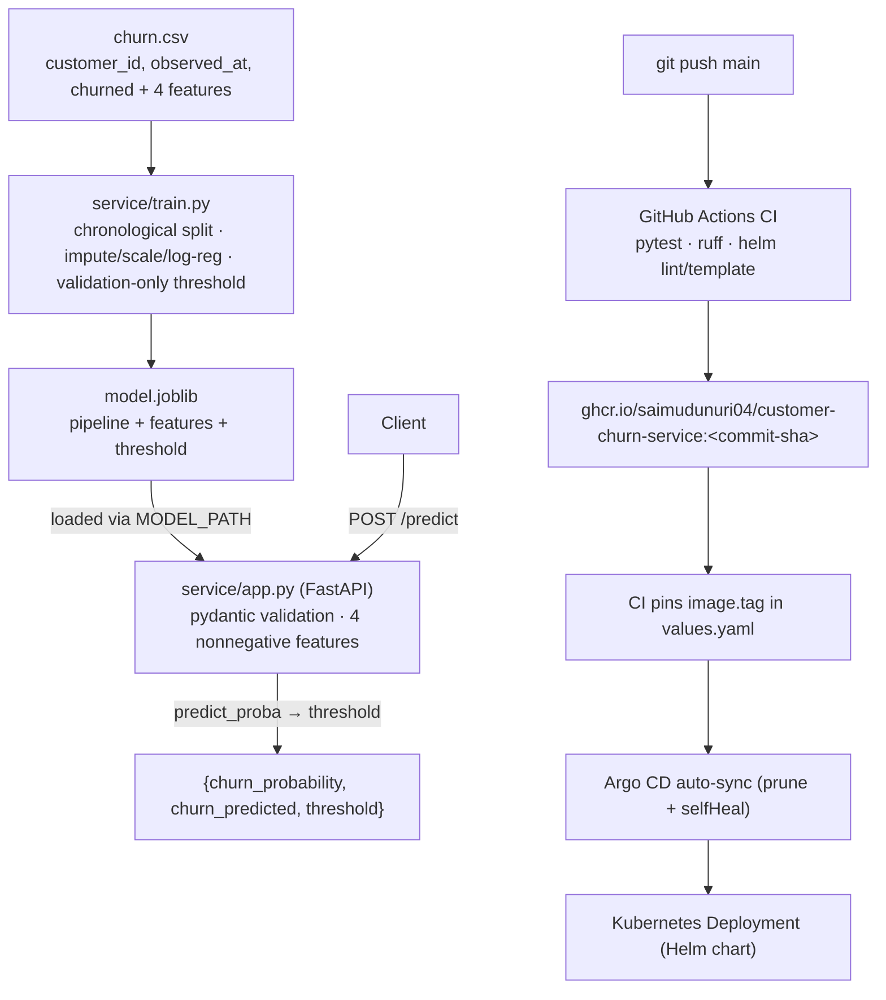

# Churn scoring

[Architecture](#architecture) · [docs/architecture.md](docs/architecture.md) · [Operations runbook](docs/operations.md) · [Helm chart](k8s/helm/customer-churn-service/) · [Argo CD application](k8s/argocd/application.yaml)

## Overview

Customer churn scoring service. Trains a leakage-aware scikit-learn pipeline (median imputation with indicator, scaling, class-weighted logistic regression) with chronological splits and validation-only threshold selection, then serves bounded churn scores through a FastAPI API with feature-schema validation.

> **Reference implementation.** This repo has not been deployed to a live Kubernetes cluster or a real AWS account. The "Measured results" section below contains real engineering measurements taken locally (pytest counts, local uvicorn latency, helm lint/template validation) — not production traffic, not business-data accuracy claims.

## Architecture



Details in [docs/architecture.md](docs/architecture.md) and [docs/operations.md](docs/operations.md).

## Measured results

All numbers measured locally on 2026-09-23 (Python 3.12, repo source, synthetic reference data from the bundled test generator). They are engineering measurements, not production results.

| Measurement | Result |
|---|---|
| pytest | **5 passed** (baseline and after changes — no regressions) |
| ruff check | passes (CI uses `ruff check .`) |
| Training (synthetic reference data: 120 rows from the bundled perfectly-separable toy generator, 18-row held-out test) | ROC-AUC **1.0000**, threshold **0.15** selected on validation (F1) — toy generator, not a real benchmark |
| API latency, `POST /predict` (n=200, all HTTP 200, local uvicorn single worker, freshly trained synthetic artifact) | **p50 3.58 ms, p95 19.31 ms** (min 2.98 ms, max 136.28 ms) |
| `helm lint --strict` | 1 chart linted, 0 failed (informational: icon recommended) |
| `helm template` (default values and CI-mirrored `--set autoscaling.enabled=true --set networkPolicy.enabled=true`) | renders 5 / 7 documents; all parse, required fields present, Deployment `envFrom` ConfigMap reference resolves |

Note: `kubectl apply --dry-run=client` requires a reachable cluster for API discovery; no cluster is available in this environment, so rendered manifests were validated with helm lint/template plus a structural YAML check (apiVersion/kind/metadata + cross-reference resolution) instead of being applied to a live cluster.

## Setup

```sh
python -m pip install -e '.[test]'
python -m pytest -q
ruff check .
helm lint k8s/helm/customer-churn-service --strict
```

## Usage

Train an artifact, then serve it (the API reads `MODEL_PATH`):

```sh
python -m service.train --train-file /path/to/churn.csv --output artifacts
MODEL_PATH=artifacts/model.joblib uvicorn service.app:app --host 127.0.0.1 --port 8000
```

`/health/live` checks the process; `/health/ready` returns 503 when the model artifact is missing. Responses carry an `X-Request-ID`, `Cache-Control: no-store`, and `X-Content-Type-Options: nosniff`; JSON request logs omit bodies and query strings.

```sh
curl -s http://127.0.0.1:8000/health/ready
curl -s -X POST http://127.0.0.1:8000/predict \
  -H 'Content-Type: application/json' \
  -d '{"tenure_months":12,"monthly_spend":60,"support_tickets":4,"usage_hours":15}'
# {"churn_probability":0.98...,"churn_predicted":true,"threshold":0.15}
```

For SageMaker training: `python -m pip install -e '.[aws]'` then `python scripts/launch_sagemaker.py --training-s3-uri s3://your-bucket/churn-training/` (training channel must contain `churn.csv`; the script uses the `1.4-2` scikit-learn framework image and an IAM execution role).

## API reference

| Method & path | Description |
|---|---|
| `GET /health/live` | Process liveness → `{"status": "alive"}` |
| `GET /health/ready` | Readiness; 503 if the model artifact is missing or schema-mismatched |
| `POST /predict` | Churn score. Body: `tenure_months`, `monthly_spend`, `support_tickets`, `usage_hours` (each ≥0, finite). Returns `{"churn_probability", "churn_predicted", "threshold"}` where `churn_predicted = churn_probability >= threshold` |

`input churn.csv` requires `customer_id,observed_at,churned,tenure_months,monthly_spend,support_tickets,usage_hours`: each customer appears once with a nonempty ID, `observed_at` is ISO 8601, features are nonnegative (empty cells are imputed in the pipeline), and duplicates are rejected. The code sorts by observation time, selects the decision threshold on validation only, and reports ROC-AUC, F1, precision, recall, and Brier score on the untouched test period. Never load joblib files from untrusted sources.

## Deployment

**Docker.** `Dockerfile` builds a slim Python 3.11 image running `uvicorn service.app:app` as a non-root user on port 8000.

**Helm.** [`k8s/helm/customer-churn-service/`](k8s/helm/customer-churn-service/) is the single source of Kubernetes workload definitions: Deployment, Service, ServiceAccount, ConfigMap, PDB, HPA, NetworkPolicy, plus `NOTES.txt`. Real tunables live in `values.yaml` (validated by `values.schema.json`):

- `image.tag` — pinned by CI to the tested commit SHA (do not edit by hand)
- `config` — non-secret env (e.g. `MODEL_PATH`, default `/models/model.joblib`), rendered into a ConfigMap and injected via `envFrom`
- `envFromSecretName` — credentials from a cluster Secret; never commit secrets
- `volumes` / `volumeMounts` — mount a reviewed model artifact read-only (e.g. at `/models`)
- `resources`, `probes` (startup/readiness/liveness on `/health/*`), `autoscaling`, `pdb`, `networkPolicy`, security contexts, termination timing

```sh
helm lint k8s/helm/customer-churn-service --strict
helm template customer-churn-service k8s/helm/customer-churn-service --namespace customer-churn-service
helm template customer-churn-service k8s/helm/customer-churn-service --namespace customer-churn-service \
  --set autoscaling.enabled=true --set networkPolicy.enabled=true
```

**Argo CD GitOps flow.** Push to `main` → GitHub Actions CI runs pytest, ruff, and helm lint/template → builds and pushes an immutable image to `ghcr.io/saimudunuri04/customer-churn-service` with two tags — the commit SHA (immutable, what production runs) and `latest` (convenience) → pins `image.tag` in `values.yaml` to that tested SHA (`[skip ci]`) → Argo CD tracks [`k8s/argocd/application.yaml`](k8s/argocd/application.yaml) and auto-syncs the chart with prune + selfHeal (see the comment header in that file for the placeholders to review per environment). Manifests were validated with `helm lint`/`helm template` and a structural YAML check; not applied to a live cluster.

## Project structure

```
src/service/
  app.py           FastAPI app: /predict, /health/live, /health/ready, MODEL_PATH artifact loading
  train.py         chronological split, impute/scale/log-reg, validation-only threshold → model.joblib
  observability.py RequestLoggingMiddleware (X-Request-ID, no-store/nosniff headers, body-free logs)
tests/             train + API tests incl. leakage and duplicate/invalid-row guards (synthetic data)
scripts/launch_sagemaker.py  SageMaker training launcher (aws extra)
k8s/helm/customer-churn-service/   Helm chart (templates, values, JSON schema)
k8s/argocd/application.yaml        Argo CD Application (auto-sync, documented placeholders)
docs/              architecture.md, operations.md
Dockerfile         non-root uvicorn image
```

## CI status

`.github/workflows/ci.yml` runs on push/PR: install `.[test]` + ruff → `ruff check .` → `pytest -q` → `helm lint --strict` → `helm template` (default and autoscaling+networkPolicy variants). On `main` the `publish` job (needs `test`) logs in to ghcr.io with `GITHUB_TOKEN`, builds/pushes the Docker image with two tags — the commit SHA and `latest` — then pins `image.tag` in `values.yaml` to the tested commit SHA so Argo CD deploys the exact tested image.
